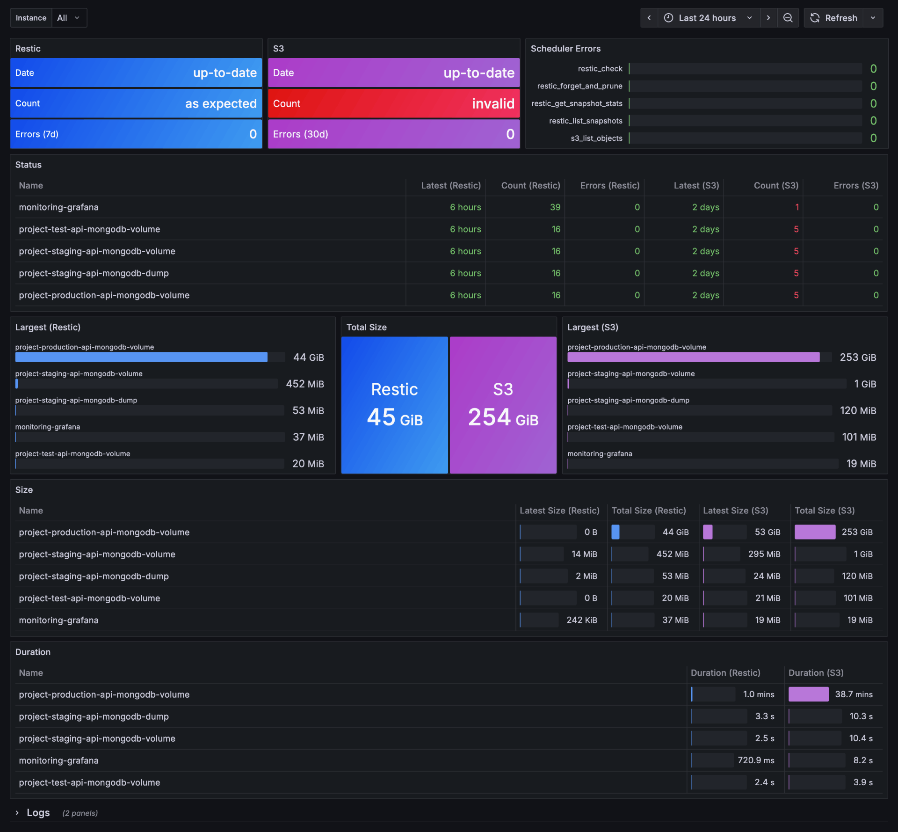

# AutoRestic

Schedule and monitor Restic backups and S3 snapshots with client-side encryption and WORM (Write Once Read Many) protection.

## Getting Started

1. Create an s3 bucket with retention mode (governance) and lifecycle policies: [see terraform module](terraform)
2. Create a `config.yml`, `.env` and `docker-compose.yml`: Examples below
3. Configure your backup directories and pre/post commands in your `config.yml`
4. Run `docker compose up`

## Limitations

- ⚠️ Docker Desktop is not supported (restic will complain about file reads despite correct mounts)

## Configuration

Configuration can be passed through environment variables and a config.yml. It's recommended to use `.env` for sensitive values (e.g. credentials) and `config.yml` for all other values.

### Example

.env (all variables are required)

```env
RESTIC_PASSWORD=
S3_ACCESS_KEY=
S3_SECRET_KEY=
S3_ENDPOINT=
S3_BUCKET=
S3_PASSPHRASE=
```

config.yml (all variables are shown with defaults and are optional)

```yaml
logging:
  level: info # one of (debug, info, warn, error)
  format: text # one of (text, json, console)

restic:
  repository: /repository
  keep_daily: 7
  keep_weekly: 4
  keep_monthly: 3

cron:
  metrics: "0 0 0 * * *" # Every day at 00:00
  backup: "0 0 2 * * *" # Every day at 02:00
  s3: "0 1 2 * * 0" # Every Sunday 02:01
  check: "0 2 2 * * 0" # Every Sunday 02:01
  prune: "0 3 2 * * 0" # Every Sunday 02:03

backups:
  - path: /data/mongodb-dump
    name: mongodb-dump
    pre_command: "docker exec -i mongodb mongodump --archive=/mongodb-dump/mongodb-dump.archive"
    post_command: "docker exec -i mongodb rm /mongodb-dump/mongodb-dump.archive"
```

docker-compose.yml

```yaml
services:
  auto-restic:
    image: ghcr.io/korbiniankuhn/auto-restic:1.0.0
    container_name: auto-restic
    ports:
      - 127.0.0.1:2112:2112
    volumes:
      - ./.env:/auto-restic/.env:ro
      - ./config.yml:/auto-restic/config.yml:ro
      - ./data:/data
      - ./restic:/repository
      - /var/run/docker.sock:/var/run/docker.sock # only required if you run docker commands for pre-post backup scripts
```

## CLI

A CLI is provided to list, remove, and restore backups (restic or S3). The CLI uses the same config as the server (e.g. for access keys, secrets).

Connect to a running container

```bash
docker exec -it auto-restic sh
```

or start a temporary one:

```bash
docker compose run --entrypoint "/bin/sh" auto-restic
```

| Command                                                          | Description                                 |
| ---------------------------------------------------------------- | ------------------------------------------- |
| ./cli restic ls                                                  | List all local backups and snapshots        |
| ./cli restic rm --name ""                                        | Remove all snapshots of a backup            |
| ./cli restic restore --snapshot-id "" --mount-path ""            | Restore snapshot to a local directory       |
| ./cli s3 ls                                                      | List all S3 backups and versions            |
| ./cli s3 rm --object-key "" --version-id ""                      | Remove S3 object with specific version      |
| ./cli s3 restore --object-key "" --version-id "" --mount-path "" | Restore object version to a local directory |

### S3 (Disaster Recovery)

S3 snapshots are encrypted with age using the provided passphrase. To decrypt a backup without using the CLI run:

```bash
age -d -o your-backup-name.tar.gz your-backup-name.tar.gz.age
# Enter your passphrase
```

## Monitoring

Prometheus metrics are exported under [localhost:2112/metrics](localhost:2112/metrics)

```yaml
# HELP backup_restic_snapshot_count Total number of restic snapshots per backup name
# TYPE backup_restic_snapshot_count gauge
backup_restic_snapshot_count{backup_name="mongodb-dump"} 2
backup_restic_snapshot_count{backup_name="production"} 7
backup_restic_snapshot_count{backup_name="staging"} 5
# HELP backup_restic_snapshot_errors_total Total number of errors creating restic snapshots per backup name
# TYPE backup_restic_snapshot_errors_total counter
backup_restic_snapshot_errors_total{backup_name="mongodb-dump"} 1
# HELP backup_restic_snapshot_latest_duration_seconds Duration in seconds of the latest restic snapshot per backup name
# TYPE backup_restic_snapshot_latest_duration_seconds gauge
backup_restic_snapshot_latest_duration_seconds{backup_name="production"} 0.78878625
backup_restic_snapshot_latest_duration_seconds{backup_name="staging"} 0.777218083
# HELP backup_restic_snapshot_latest_size_bytes Size in bytes of the latest restic snapshot per backup name
# TYPE backup_restic_snapshot_latest_size_bytes gauge
backup_restic_snapshot_latest_size_bytes{backup_name="mongodb-dump"} 1240
backup_restic_snapshot_latest_size_bytes{backup_name="production"} 0
backup_restic_snapshot_latest_size_bytes{backup_name="staging"} 0
# HELP backup_restic_snapshot_latest_timestamp_seconds Unix timestamp of the latest restic snapshot per backup name
# TYPE backup_restic_snapshot_latest_timestamp_seconds gauge
backup_restic_snapshot_latest_timestamp_seconds{backup_name="mongodb-dump"} 1.749808336e+09
backup_restic_snapshot_latest_timestamp_seconds{backup_name="production"} 1.75707894e+09
backup_restic_snapshot_latest_timestamp_seconds{backup_name="staging"} 1.75707894e+09
# HELP backup_restic_snapshot_total_size_bytes Total size in bytes of all restic snapshots per backup name
# TYPE backup_restic_snapshot_total_size_bytes gauge
backup_restic_snapshot_total_size_bytes{backup_name="mongodb-dump"} 2527
backup_restic_snapshot_total_size_bytes{backup_name="production"} 3244
backup_restic_snapshot_total_size_bytes{backup_name="staging"} 2172
# HELP backup_s3_snapshot_count Total number of S3 snapshots per backup name
# TYPE backup_s3_snapshot_count gauge
backup_s3_snapshot_count{backup_name="mongodb-dump"} 7
backup_s3_snapshot_count{backup_name="production"} 8
backup_s3_snapshot_count{backup_name="staging"} 8
# HELP backup_s3_snapshot_latest_size_bytes Size in bytes of the latest S3 snapshot dump per backup name
# TYPE backup_s3_snapshot_latest_size_bytes gauge
backup_s3_snapshot_latest_size_bytes{backup_name="mongodb-dump"} 711
backup_s3_snapshot_latest_size_bytes{backup_name="production"} 395
backup_s3_snapshot_latest_size_bytes{backup_name="staging"} 389
# HELP backup_s3_snapshot_latest_timestamp_seconds Unix timestamp of the latest S3 snapshot dump per backup name
# TYPE backup_s3_snapshot_latest_timestamp_seconds gauge
backup_s3_snapshot_latest_timestamp_seconds{backup_name="mongodb-dump"} 1.75707841e+09
backup_s3_snapshot_latest_timestamp_seconds{backup_name="production"} 1.757078405e+09
backup_s3_snapshot_latest_timestamp_seconds{backup_name="staging"} 1.757078407e+09
# HELP backup_s3_snapshot_total_size_bytes Total size in bytes of all S3 snapshots per backup name
# TYPE backup_s3_snapshot_total_size_bytes gauge
backup_s3_snapshot_total_size_bytes{backup_name="mongodb-dump"} 4266
backup_s3_snapshot_total_size_bytes{backup_name="production"} 2765
backup_s3_snapshot_total_size_bytes{backup_name="staging"} 2723
# HELP backup_scheduler_errors_total Total number of scheduler errors by operation (e.g. restic check, prune, list snapshots)
# TYPE backup_scheduler_errors_total counter
backup_scheduler_errors_total{operation="restic_check"} 0
backup_scheduler_errors_total{operation="restic_forget_and_prune"} 0
backup_scheduler_errors_total{operation="restic_get_snapshot_stats"} 0
backup_scheduler_errors_total{operation="restic_list_snapshots"} 0
backup_scheduler_errors_total{operation="s3_list_objects"} 0
```

## Grafana

A prebuilt dashboard is [here](dashboard.json)



## Credits

- [https://github.com/go-co-op/gocron](https://github.com/go-co-op/gocron)
- [https://github.com/spf13/viper](https://github.com/spf13/viper)
- [https://github.com/spf13/cobra](https://github.com/spf13/cobra)
- [https://github.com/FiloSottile/age](https://github.com/FiloSottile/age)
